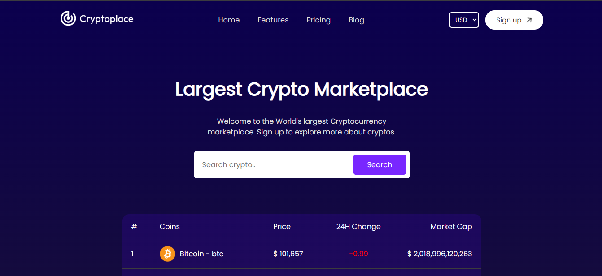
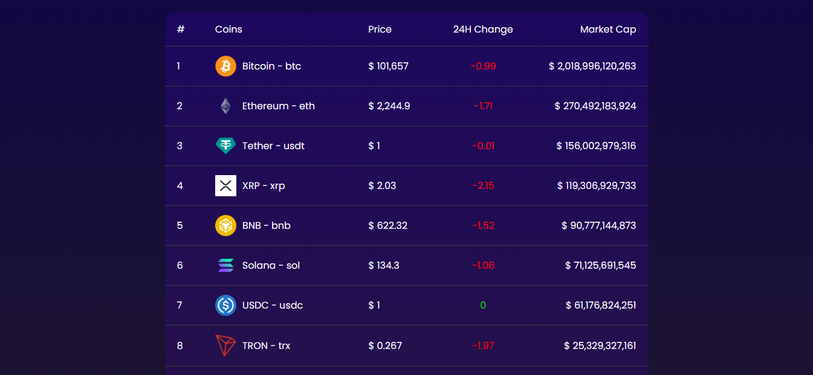
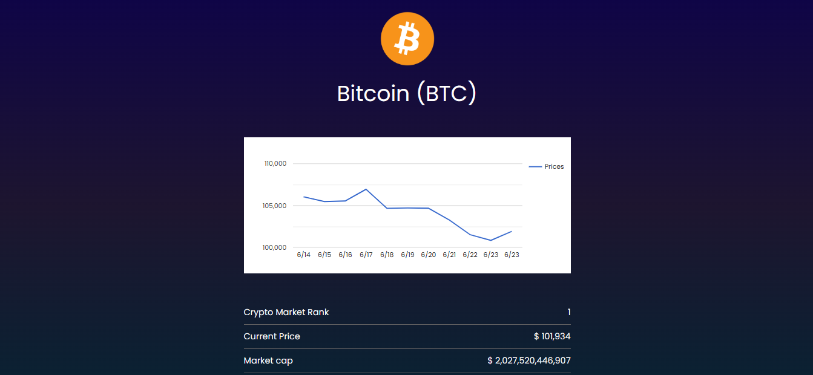

# 🌐 Largest Crypto Marketplace

Welcome to the **World's Largest Cryptocurrency Marketplace** — your gateway to real-time crypto data, powerful analytics, and market insights.

## 🚀 Project Overview

This web application is a fully responsive cryptocurrency marketplace built with **ReactJS**, utilizing **CoinGecko's public API** for live crypto data. The platform allows users to:

- 🔍 Explore thousands of cryptocurrencies
- 📈 View real-time market prices and charts
- 💰 Track market cap, volume, and historical data
- 🔐 Sign up to access premium features (planned)

## 🛠️ Features

- ✅ Live Cryptocurrency Data (powered by CoinGecko API)
- 📊 Dynamic Line Charts for price history
- 🔎 Detailed Coin Pages with rich stats
- 🌐 Currency Selection (USD, INR, EUR, etc.)
- 🧭 Easy Navigation using React Router
- 💡 React Context for global state management
- 🎨 Responsive UI for all devices

## 📸 Screenshots

> Below are a few snapshots of the Largest Crypto Marketplace in action:

### 🏠 Home Page

### 💰 Coin Detail Page

### 📊 Live Chart

## 📦 Tech Stack

| Tool            | Purpose                                      |
|-----------------|----------------------------------------------|
| **ReactJS**     | Frontend Framework                           |
| **CoinGecko API** | Fetching real-time cryptocurrency data      |
| **React Router**| Client-side routing                          |
| **React Context**| State management (currency, coins, etc.)     |
| **CSS Modules** | Styling individual components                |
| **Chart.js / Recharts** | Displaying coin historical charts      |
| **Vite**        | Fast build tool for development              |

## 📂 Folder Structure

cryptomarketplace/
│
├── public/
├── src/
│ ├── assets/
│ ├── components/
│ │ ├── Navbar.jsx
│ │ ├── Footer.jsx
│ │ └── LineChart/LineChart.jsx
│ ├── context/
│ │ └── CoinContext.jsx
│ ├── pages/
│ │ ├── Home/
│ │ └── Coin/
│ ├── App.jsx
│ ├── main.jsx
│ └── index.css
├── package.json
└── README.md

# 💡 Future Enhancements
🧾 User Authentication & Sign-Up

💼 Watchlist and Portfolio Management

🔔 Price Alerts

🌍 Multi-language and Multi-currency support

📱 PWA Support (Add to Home Screen)

 # 🤝 Contributing
Contributions are welcome! Please fork the repository and submit a pull request.

# 📄 License
This project is licensed under the MIT License.
